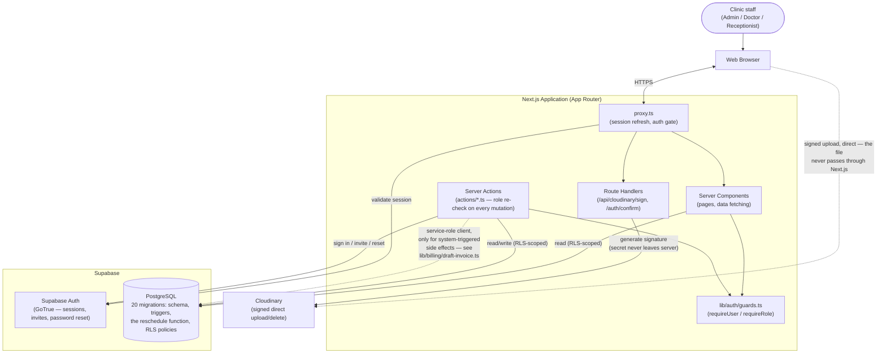

# System Architecture

The high-level shape mandated by Section 2:

```
User → Web Browser → Next.js Application → Supabase / PostgreSQL
                            ↓
                       Cloudinary (files & images)
```

Expanded to show the three enforcement layers (Section 3) and how a
request actually flows through this specific codebase:



## Why the browser talks to Cloudinary directly

Section 5.8 requires signed uploads. The signature is generated
server-side (`/api/cloudinary/sign`, using the API secret, which never
reaches the client bundle), but the actual file upload happens as a
direct `POST` from the browser to Cloudinary's API — proxying the file
bytes through the Next.js server would add latency and a size limit for
no security benefit, since the signature already constrains what the
upload is allowed to do (folder, allowed formats).

## The three enforcement layers (Section 3)

1. **`proxy.ts`** — coarse-grained: is there a session at all. Redirects
   an unauthenticated request to `/login` before any protected route
   renders.
2. **`lib/auth/guards.ts`**, called at the top of every protected
   layout/page and every Server Action — role-specific: `requireRole([...])`
   redirects a wrong-role page visit; `requireRoleForAction([...])`
   returns a typed error a wrong-role mutation attempt.
3. **Postgres Row Level Security** (`supabase/migrations/0020_rls_policies.sql`)
   — the actual authority. Layers 1 and 2 exist for good UX and defence
   in depth; RLS is what makes a bypassed or buggy layer 1/2 check
   non-catastrophic; a request that got past both would still be
   rejected at the database.

## Deliberate exception: the service-role client

`lib/billing/draft-invoice.ts` uses Supabase's service-role client
(bypasses RLS) for exactly one thing: auto-drafting an invoice when an
appointment is completed. A doctor can trigger this by saving a
consultation, but doctors have zero RLS access to `invoices` — the
draft is a system-triggered side effect of completing a visit, not a
financial action the doctor is performing, the same category as the
`handle_new_auth_user` trigger creating a profile regardless of who
created the auth user. Every other billing mutation a human performs
(`actions/billing.ts`) goes through the normal RLS-respecting client.
