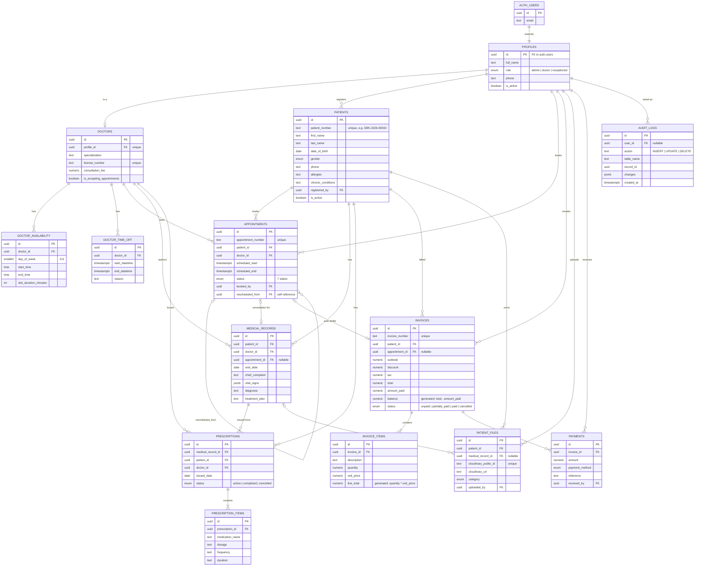

# Entity-Relationship Diagram

Covers all 14 tables from Section 4 of the build spec. `auth.users` is
Supabase-managed (not one of ours) but shown for context, since
`profiles` extends it 1:1.

## Notes not obvious from the diagram alone

- **`appointments_no_overlap`** (0009): a Postgres `EXCLUDE USING gist`
  constraint, not representable in an ER diagram's cardinality notation
  — no two non-cancelled appointments for the same `doctor_id` can have
  overlapping `[scheduled_start, scheduled_end)` ranges. This is what
  makes double-booking impossible at the database level (Section 4,
  Acceptance Criteria).
- **`rescheduled_from`** is a nullable self-reference on `appointments`:
  rescheduling cancels the original row and inserts a new one linked
  back to it (0021's `reschedule_appointment` function), rather than
  mutating the original's time in place.
- **`balance` and `line_total`** are Postgres generated columns, not
  application-computed — they can never drift from `total - amount_paid`
  / `quantity * unit_price`.
- Every foreign key from a clinical/financial table back to `patients`
  is `ON DELETE RESTRICT`, not `CASCADE` — Section 7's "never silently
  cascade a patient's history away." Patients are soft-deleted
  (`is_active = false`) instead.
