# Use-Case Diagram

Mermaid has no native UML use-case notation (actor ⚬ + use-case ellipse),
so this uses the standard workaround: a flowchart with actor nodes and
stadium-shaped use-case nodes, joined by plain associations. Chosen over
PlantUML (the spec's other option) because GitHub and most markdown
viewers render Mermaid natively — a PlantUML use-case diagram would need
a separate renderer to view at all.

Covers all three roles (Section 3's permissions matrix); use cases are
grouped by module.

```mermaid
flowchart LR
    Admin(["👤 Admin"])
    Doctor(["👤 Doctor"])
    Receptionist(["👤 Receptionist"])

    subgraph Auth["Authentication"]
        UC1(("Sign in / reset password"))
        UC2(("Invite staff, assign role, deactivate"))
    end

    subgraph Patients["Patient Management"]
        UC3(("Register / edit patient"))
        UC4(("View patient record"))
        UC5(("Deactivate patient"))
    end

    subgraph Doctors["Doctor Management"]
        UC6(("Manage doctor profiles"))
        UC7(("Set own availability & time off"))
        UC8(("View doctor directory"))
    end

    subgraph Appts["Appointment Booking"]
        UC9(("Book appointment"))
        UC10(("Reschedule / cancel appointment"))
        UC11(("Manage appointment lifecycle<br/>(confirm → check-in → in progress → complete)"))
        UC12(("View today's queue"))
    end

    subgraph EMR["Medical Records"]
        UC13(("Create / edit consultation record"))
        UC14(("View patient history"))
    end

    subgraph Rx["Prescriptions"]
        UC15(("Issue prescription"))
        UC16(("Print prescription slip"))
    end

    subgraph Billing["Billing"]
        UC17(("Create invoice / add line items"))
        UC18(("Record payment"))
        UC19(("View outstanding balances"))
    end

    subgraph Files["File Management"]
        UC20(("Upload patient file"))
        UC21(("Delete own uploaded file"))
    end

    subgraph Reports["Reports & Dashboards"]
        UC22(("View role-aware dashboard"))
        UC23(("View reports, export CSV"))
        UC24(("View audit log"))
    end

    Admin --- UC1
    Admin --- UC2
    Admin --- UC3
    Admin --- UC4
    Admin --- UC5
    Admin --- UC6
    Admin --- UC8
    Admin --- UC9
    Admin --- UC10
    Admin --- UC11
    Admin --- UC12
    Admin --- UC14
    Admin --- UC16
    Admin --- UC17
    Admin --- UC18
    Admin --- UC19
    Admin --- UC20
    Admin --- UC21
    Admin --- UC22
    Admin --- UC23
    Admin --- UC24

    Doctor --- UC1
    Doctor --- UC4
    Doctor --- UC7
    Doctor --- UC8
    Doctor --- UC9
    Doctor --- UC10
    Doctor --- UC11
    Doctor --- UC13
    Doctor --- UC14
    Doctor --- UC15
    Doctor --- UC16
    Doctor --- UC20
    Doctor --- UC21
    Doctor --- UC22

    Receptionist --- UC1
    Receptionist --- UC3
    Receptionist --- UC4
    Receptionist --- UC5
    Receptionist --- UC8
    Receptionist --- UC9
    Receptionist --- UC10
    Receptionist --- UC11
    Receptionist --- UC12
    Receptionist --- UC17
    Receptionist --- UC18
    Receptionist --- UC19
    Receptionist --- UC20
    Receptionist --- UC21
    Receptionist --- UC22
```

## Deliberately excluded associations

A few cells in Section 3's matrix are "view only" or "own X only" —
represented here by *omitting* the association rather than adding a
qualifier, since Mermaid's use-case workaround has no clean way to
annotate an edge as restricted:

- Doctor **isn't** connected to UC3/UC5 (register/deactivate patients) —
  view only, no association per the matrix.
- Receptionist **isn't** connected to UC13/UC14/UC15 (medical
  records/prescriptions) — no access at all, not even view.
- Doctor **isn't** connected to UC17/UC18/UC19 (billing) — no access at
  all.
- UC7 (set availability) only connects to Doctor, not Admin — admin's
  equivalent capability is folded into UC6 (manage doctor profiles),
  since in the actual UI an admin edits any doctor's schedule from the
  same `/doctors/[id]` page a doctor uses for their own.
